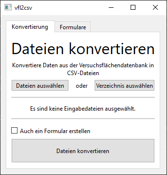
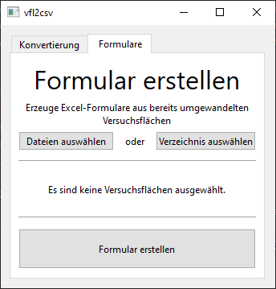

# Dokumentation

## Installation

Das Programm kann von dem [Repository](https://github.com/davidhi7/vfl2csv/releases/latest) heruntergeladen werden.
Entwickelt wurde das Programm für Windows, Linux und MacOS, wobei ich das Programm auf MacOS nicht testen kann und es
daher möglicherweise nicht funktioniert.

Für die Installation muss bei dem oben gegebenen Link unter `Assets` die zip-Datei für das entsprechende Betriebssystem
heruntergeladen und anschließend entpackt werden.
Anschließend kann die Datei `vfl2csv_gui.bin` (Linux, MacOS) oder `vfl2csv_gui.exe` (Windows) ausgeführt werden, um das
Programm zu nutzen.

## Anwendung

Das Programm hat zwei Kernfunktionen, denen jeweils eine Registerkarte gewidmet ist:

1. **Umwandlung von Daten aus der Versuchsflächendatenbank in CSV-Dateien**
   

2. **Erzeugung von Excel-Formularen aus bereits umgewandelten CSV-Dateien**
   

Bei beiden Funktionen können entweder einzelne Eingabedateien (`Dateien auswählen`) oder ein ganzes
Verzeichnis (`Verzeichnis auswählen`) ausgewählt werden.

Wenn ein ganzes Verzeichnis ausgewählt wird, werden standartmäßig auch alle Unterverzeichnisse durchsucht.
Wichtig ist hierbei, dass sich in diesen Verzeichnissen keine anderen Dateien mit gleicher Dateiendung (standardmäßig
.txt) befinden, da diese sonst Fehler verursachen können.

### 1. Umwandlung von Daten aus der Versuchsflächendatenbank in CSV-Dateien

Als Eingabedateien werden standardmäßig TSV-Dateien (tab-separated values), also Textdateien mit folgendem Format
erwartet:

```
Exportierte Tabelle Messdaten Durchmesser / Höhen
Versuchsflächendatenbank vom 10.12.2022  14:58:16
Nutzer    : [...]

Aufnahme	Aufnahme	Aufnahme	23.07.1984	23.07.1984	23.07.1984	26.04.1995	26.04.1995	26.04.1995	10.11.2006	10.11.2006	10.11.2006	03.12.2013	03.12.2013	03.12.2013	
Wert	Wert	Wert	D	Aus	H	D	Aus	H	D	Aus	H	D	Aus	H	
Einheit	Einheit	Einheit	cm		m	cm		m	cm		m	cm		m	
Bst.-E.	Art	Baum	159	15	30	144	50	34	94	31	30	63	0	33
[...]
```

Bei der Konvertierung wird jede Versuchsfläche in diesem Format in eine CSV-Datei für die Messdaten sowie eine Textdatei
für die Metadaten der Versuchsfläche (z. B. Versuch oder Parzelle) umgewandelt.
Organisiert werden diese Ausgabedateien in Verzeichnissen nach Revier und Versuch.

Optional kann nach der Umwandlung der Versuchsflächen direkt ein Excel-Formular für diese Versuchsflächen erstellt
werden, indem ein Haken bei `Auch ein Formular erstellen` gesetzt wird.

### 2. Erzeugung von Excel-Formularen aus bereits umgewandelten CSV-Dateien

Nachdem Versuchsflächendaten mit dem Verfahren unter 1. konvertiert wurden, können aus diesen Daten Excel-Formulare für
die Aufnahme neuer Messwerte erzeugt werden.
Dafür müssen entweder die Metadaten-Dateien direkt oder Verzeichnisse mit diesen Dateien ausgewählt werden.
Das anschließend erzeugte Excel-Formular enthält ein Tabellenblatt für jede Versuchsfläche mit den letzten Messwerten
sowie Spalten für die neuen Messwerte. Weiterhin werden Spalten für die Differenzen sowie Mittelwerte der neuen
Messreihen erstellt.
